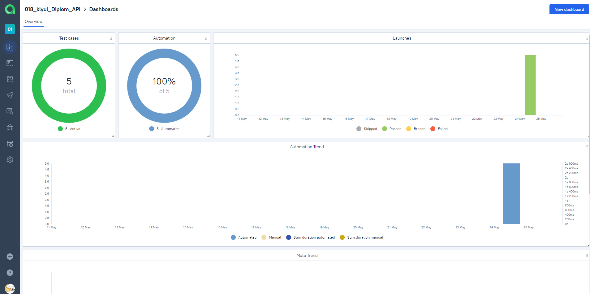
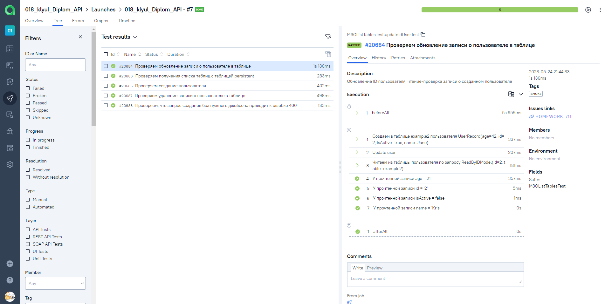
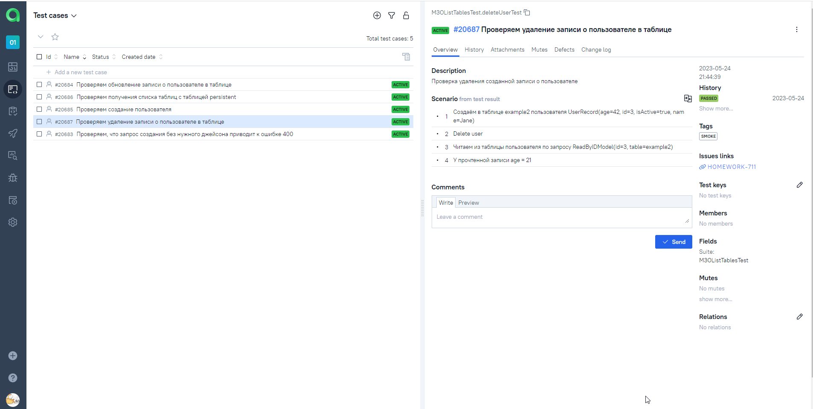
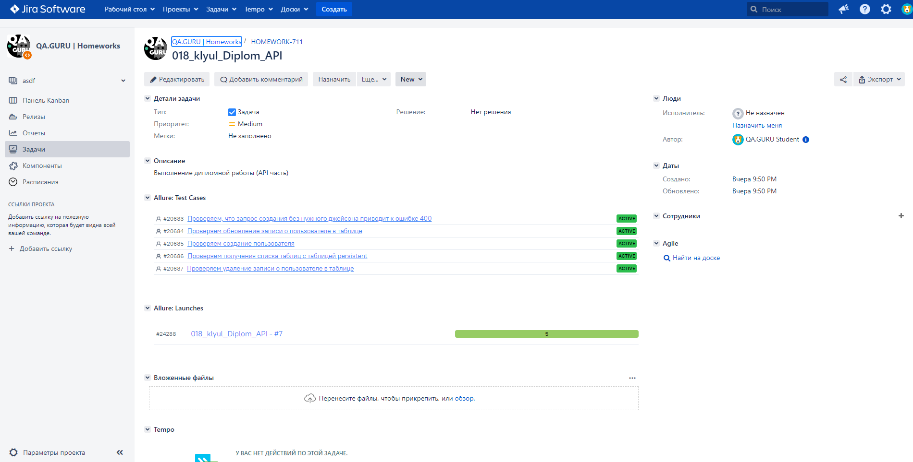

# Проект по автоматизации тестирования API M3o
<a target="_blank" href="https://m3o.com/">Cайт M3o</a>


## :pushpin: <a id="list"></a> Содержание:

* <a href="#tools">Технологии и инструменты</a>

* <a href="#cases">Реализованные проверки</a>

* <a href="#console">Запуск из терминала</a>

* <a href="#jenkins">Сборка в Jenkins</a>

* <a href="#allure">Allure отчеты</a>

* <a href="#telegram">Отчёт в Telegram</a>

* <a href="#testops">Интеграция с Allure TestOps</a>

* <a href="#jira">Интеграция с Jira</a>


## :hammer_and_wrench: <a id="tools"></a> Технологии и инструменты
<p align="center">
<a href="https://www.jetbrains.com/idea/"></a>
<a href="https://www.java.com/"></a>
<a href="https://github.com/"></a>
<a href="https://junit.org/junit5/"></a>
<a href="https://gradle.org/"></a>
<a href="https://selenide.org/"></a>
<a href="https://github.com/allure-framework/allure2"></a>
<a href="https://www.jenkins.io/"></a>
</p>


## :scroll: <a id="cases"></a> Реализованные проверки

* Проверка наличия таблицы
* Создание записи
* Изменение записи
* Удаление записи
* Негативный тест на создание записи без требуемого JSON

## :computer: <a id="console"></a> Запуск из терминала
```bash
 gradle clean test
```

## <a href="https://www.jenkins.io/" id="jenkins"></a> Сборка в [Jenkins](https://jenkins.autotests.cloud/job/018_klyul_Diplom_API/)

Для запуска сборки необходимо нажать кнопку <code><strong>*Собрать*</strong></code>.
<a href="https://https://jenkins.autotests.cloud/job/018_klyul_Diplom_API/#"></a>
<p align="center">
</p>

## <a href="https://github.com/allure-framework/allure2" id="allure"></a> Allure отчеты
:information_source: По итогам сборки в Jenkins собирается [отчет в Allure Report](https://jenkins.autotests.cloud/job/018_klyul_Diplom_API/allure/)
> Для просмотра необходимо залогиниться в Jenkins
* Подключено добавление в отчет:
- данные запроса
- данные ответа API

<p align="center">


</p>

## <a id="telegram"></a> Отчёт в Telegram 

После завершения сборки сообщение с основными результатами прогона тестов отправляется через созданный бот в выбранный телеграм-канал
<p align="center">


##  <a id="testops"></a> Интеграция с [Allure TestOps](https://allure.autotests.cloud/project/2344/launches)


### Основной дашборд
<p align="center">

</p>

### Список тестов с результатами прогона

<p align="center">
  
</p>

### Тест-кейсы
Тест-кейсы, автоматические созданные в Allure Testops, на основе разработанных автотестов
<p align="center">
  
</p>

## <a id="jira"></a> Интеграция с [Jira](https://jira.autotests.cloud/browse/HOMEWORK-711)


:information_source: Настроена интеграция Allure TestOps с Jira.
Тест-кейсы и результаты прогонов можно прикреплять к необходимым задачам.

